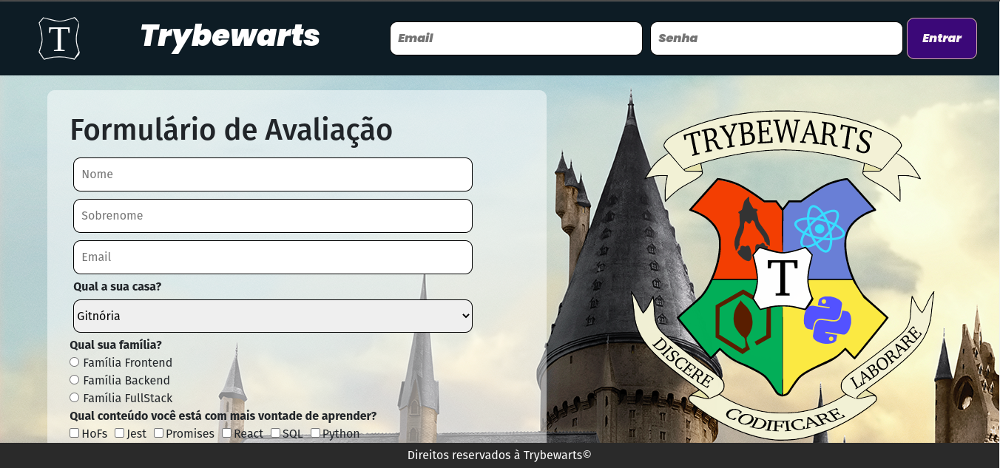

# Project Trybewarts

Este repositório contém o projeto Trybewarts desenvolvido por [Raquel G. C Würzler](https://www.linkedin.com/in/raquel-c-wurzler/) & [Natália Matos Silveira](https://github.com/nataliamsilveira) enquanto estudavam na [Trybe](https://www.betrybe.com/) no módulo de Fundamentos :rocket:

_"A Trybe é uma escola do futuro para qualquer pessoa que queira melhorar de vida e construir uma carreira de sucesso em tecnologia, onde a pessoa paga quando conseguir um bom trabalho."_

#### Projeto de conclusão da seção 6, no módulo de Fundamentos

### Principal objetivo:
* Usando HTML, JavaScript e CSS desenvolver uma página de formulário da Escola de Magia de Trybewarts, em que as pessoas estudantes poderão enviar seus feedbacks sobre ela. O tema desse projeto é baseado na obra 'Harry Potter', de J. K. Rowling.

### O que foi entregue:

  
🤓

  

   

### Habilidades trabalhadas nesse projeto:
* Construção de uma página de formulário usando HTML;
* Usar todas as tags HTML disponíveis no formulário;
* Usar JavaScript para manipular os elementos HTML;
* Usar CSS para posicionar os elementos HTML da melhor forma possível;
* Usar CSS para melhorar a estética da página;
* No documento script.js contém a descrição dos requisitos;

##### Requisitos feitos por mim:
* Inputs e funcionalidades de "Qual conteúdo", "Avaliação", "Deixe seu comentário" [_HTML e JavaScript_];
* Funcionalidade do botão Enviar;
* CSS;

##### Requisitos feitos pela [Natália](https://github.com/nataliamsilveira):
* Criação e funcionalidades do haeder e footer [HTML e JavaScript];
* Inputs e funcionalidades de "nome", "sobrenome", "email", "Qual a sua casa?" e "Qual sua família?" [_HTML e JavaScript_];

##### Arquivos disponibilizados pela Trybe:
* .editorconfig;
* .eslintignore;
* .eslintrc.json;
* .gitignore;
* .npmrc;
* .stylelintignore;
* .stylelintrc.json;
* as imagens de logomarca da trybewarts;

##### Link Deploy: https://sage-scone-2d1e29.netlify.app/
